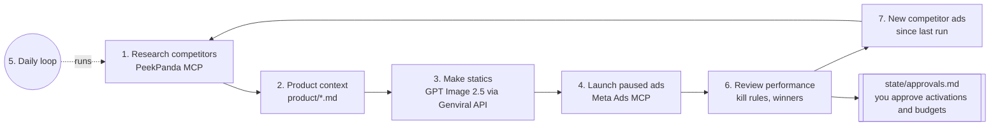

# Ad factory

A Claude Code project that runs a static-image Meta ad factory for a mobile app. Every day it studies competitor ads, makes new statics from your product notes, uploads them to Meta as paused ads, pauses losers by fixed rules and asks you before anything goes live or any budget moves.

It is a set of Claude Code skills plus two small Node scripts. No server, no database, no dependencies.

## How it works



1. **Research.** Finds competitor apps, tracks them on a PeekPanda board, pulls their long-running static ads and analyzes the images. Meta publishes no spend or results, so days live is the performance proxy.
2. **Product context.** Everything the factory says about your app comes from `product/*.md`.
3. **Statics.** GPT Image 2.5 through the Genviral API: `gpt-image-2.5-flare` for cheap concept rounds, `gpt-image-2.5-sunburst` for finals (sharper text, better brand fidelity). Each image is self-reviewed for legible text, brand colors, no fake UI and policy risks.
4. **Launch.** Creatives and ads are created as drafts or paused ads (never live) with a fixed naming scheme and recorded in a resumable ledger.
5. **Daily loop.** One command runs the whole cycle and writes `reports/<date>.md`.
6. **Review.** Pulls per-ad insights, applies your kill rules with a deterministic script, pauses losers, flags winners and proposes budget changes.
7. **Competitors in the loop.** Each run looks at competitor ads discovered since the last run.

### What runs on its own and what waits for you

| Automatic | Needs your one-tap approval |
|---|---|
| Competitor research | Activating any ad |
| Generating images | Any budget change |
| Uploading new ads as PAUSED | |
| Pausing ads that break a kill rule | |

Approvals are lines in `state/approvals.md`. Change `[ ]` to `[x]` (or tell Claude "approve APR-...") and the next run applies them. The daily report lists every pending approval at the top.

## Requirements

- **Claude Code** (or Claude Desktop with this folder) and Node.js 20 or newer.
- **A Genviral API key.** Image generation goes through the [Genviral Partner API](https://docs.genviral.io), never to OpenAI directly. You need a paid Genviral plan with API access and credits. Create a key under API Keys at [genviral.io](https://www.genviral.io).
- **A Meta Ads MCP.** Default: Meta's official ads MCP server, `https://mcp.facebook.com/ads` ([docs](https://developers.facebook.com/documentation/ads-commerce/ads-ai-connectors/ads-mcp-server/ads-mcp-server-overview)). Alternative: [Pipeboard's Meta Ads MCP](https://github.com/pipeboard-co/meta-ads-mcp), `https://meta-ads.mcp.pipeboard.co/`.
- **The PeekPanda MCP** at `https://mcp.peekpanda.com/mcp` for competitor apps and ads. Needs a PeekPanda account.
- A Meta ad account with an app promotion campaign and at least one ad set that you created in Ads Manager. The factory adds ads to your ad sets. It never creates campaigns or ad sets or changes targeting.

## Quickstart (about 10 minutes)

```bash
git clone <this repo> my-ad-factory && cd my-ad-factory
cp factory.config.example.json factory.config.json   # fill in your ids and targets
cp .env.example .env                                   # paste your GENVIRAL_API_KEY
```

You can register both MCP servers for this project by copying `.mcp.json.example` to `.mcp.json` and signing in with `/mcp`, or add them one by one:

1. **Connect PeekPanda.**
   ```bash
   claude mcp add --transport http peekpanda https://mcp.peekpanda.com/mcp
   ```
   Then run `/mcp` inside Claude Code and sign in. For headless use you can send a PeekPanda API key as a bearer token instead (`--header "Authorization: Bearer <key>"`).
2. **Connect Meta.** Meta documents this command for Claude Code:
   ```bash
   claude mcp add --transport http --client-id <META_APP_ID> meta-ads https://mcp.facebook.com/ads
   ```
   It uses Facebook Login for Business (OAuth) through your own Meta developer app with the "Create & manage ads with ads MCP server" use case. Without a Meta app, add `https://mcp.facebook.com/ads` as a custom connector in Claude (Desktop or claude.ai) and sign in with Facebook, as described in [Meta's help article](https://www.facebook.com/business/help/1456422242197840). Pipeboard instead: `claude mcp add --transport http meta-ads https://meta-ads.mcp.pipeboard.co/`, then `/mcp` to sign in.
3. **Fill in your product.** Complete every file in `product/` and put your icon, logo and real screenshots in `product/assets/`.
4. **Load your key and start Claude.**
   ```bash
   set -a && . ./.env && set +a && claude
   ```
5. **First run.** Ask Claude: `run the research-competitors skill in full mode`, read `research/`, then `run the daily-loop skill`. Check `reports/<today>.md` and approve the ads you like in `state/approvals.md`.

## Configuration

All settings live in `factory.config.json`.

| Key | What it does |
|---|---|
| `app.app_store_id`, `app.app_store_url` | Your iOS app. Used for competitor lookup and as the ad link |
| `meta.ad_account_id`, `page_id`, `campaign_id`, `test_ad_set_ids` | Where ads go. The factory only reads the campaign and adds ads to these ad sets |
| `meta.conversion_action_type` | The event that counts as a conversion, e.g. `start_trial_mobile_app`. On the official MCP it must match the `results` indicator of your campaign (`conversions:<event>`) |
| `meta.ai_disclosure` | `OPT_IN` or `OPT_OUT`: whether your creatives declare AI-generated media. Required in the EU and some US states. It is your call, it is set once per creative and cannot be changed later |
| `targets.target_cpa` | Your target cost per conversion (for example cost per trial), in account currency |
| `budget.daily_budget_cap`, `max_budget_change_pct` | Hard limits for budget approvals |
| `kill_rules.*` | See below |
| `creative.new_ads_per_run`, `concepts_per_angle`, `angles_per_run` | Batch size per run |
| `creative.aspect_ratios`, `launch_aspect` | Finals are made in 1:1, 4:5 and 9:16. Ads launch with the `launch_aspect` image |
| `image_models.concept`, `image_models.final` | Model id, quality (`low`/`medium`/`high`) and size (`1K`/`2K`/`4K`) |
| `research.*` | Competitor board name, how many to track, formats and minimum run days |
| `meta_api.*` | Pacing and cooldown settings (see Safety) |

### Kill rules

Applied by `scripts/judge-ads.mjs`, in this order, only to ACTIVE ads the factory created:

| Verdict | Default rule |
|---|---|
| learning | Ad is younger than `min_age_days` (3). Never judged early |
| pause | 0 conversions and spend >= `no_conversion_spend_multiple` (2) x target CPA |
| pause | Spend >= `high_cpa_spend_multiple` (3) x target CPA and CPA > `high_cpa_ratio` (1.5) x target |
| winner | At least `winner_min_conversions` (5) conversions and CPA <= `winner_cpa_ratio` (1.0) x target |
| keep | Anything else |

Pauses happen automatically. Winners trigger a budget proposal that waits for you.

## Scheduling

**Claude Code routines (recommended).** In Claude Code run `/schedule` and create a daily routine with the prompt `run the daily-loop skill`. Routines run in the cloud on a checkout of your repo, so make sure that environment has the PeekPanda and Meta connectors and `GENVIRAL_API_KEY`, and that `state/`, `reports/` and `research/` persist between runs (for example a private fork where the routine commits them).

**Local cron or launchd.** Keeps all state on your machine:

```cron
# crontab -e : every day at 07:00
0 7 * * * cd /path/to/my-ad-factory && set -a && . ./.env && set +a && claude -p "run the daily-loop skill" >> reports/cron.log 2>&1
```

On macOS you can wrap the same command in a launchd agent with `StartCalendarInterval`. Unattended runs use exactly the same approval gates: nothing is activated and no budget changes without a ticked approval.

## Safety

- New ads are always created paused. Activation and budgets need your approval.
- Kill rules are plain numbers in your config, applied by a tested script, not by judgment.
- Meta API discipline: one run per ad account at a time (lock file), no polling of async status, at least 3 seconds between writes, batched reads, a resumable ledger, and a 20-minute stop on error codes 17, 80004 or 613.
- The factory only touches ads whose names start with `AF_`.
- Copy and images use only facts from your `product/` files. No invented numbers, reviews or app UI.
- Meta's official MCP also supports server-side rules in Business Suite (for example "deny budget increases above 20%"). Adding them gives you a second guard.

## Costs

- **Genviral credits** per image depend on model, quality and size. `GET https://www.genviral.io/api/partner/v1/studio/models` lists current costs. A run costs roughly `angles x concepts_per_angle x concept cost + passing angles x aspect ratios x final cost`. The script prints `credits_used` and the report totals it.
- **PeekPanda** plan. A daily delta run uses a small number of MCP calls.
- **Meta ad spend**, capped by your ad set budgets and `budget.daily_budget_cap`.
- **Claude** usage for each run. Pipeboard has a free plan and paid tiers if you use it.

## Scripts

```bash
node scripts/genviral-image.mjs --help
node scripts/genviral-image.mjs --model openai/gpt-image-2.5-sunburst --quality high --size 2K \
  --aspect 4:5 --prompt "..." --ref product/assets/logo.png --out creatives/test/final-4x5.png
node scripts/judge-ads.mjs --insights state/insights/2026-01-15.json
node --test scripts/*.test.mjs
```

`genviral-image.mjs` uploads local reference files to Genviral, calls `POST /studio/images/generate`, waits for the image, downloads it and prints JSON. It sends an `Idempotency-Key` derived from the request, so rerunning the same command replays the earlier result instead of paying again.

## FAQ

**Why static images only?** Statics are cheap to make, fast to judge and easy to review for text and policy problems. Video can come later.

**Why go through Genviral instead of OpenAI?** One key, one credit balance, hosted output URLs Meta can fetch, and reference-image handling built in.

**How do images get to Meta?** The official MCP's `ads_creative_upload_media` takes a public image URL. Genviral returns one for every image, so the factory uploads it by URL and builds the creative from the returned image hash.

**Why do new ads show up as drafts?** The official MCP stages new ads in your Ads Manager draft. Nothing serves until an approved activation publishes it. Pipeboard creates real ads with status PAUSED instead.

**Android?** PeekPanda covers iOS apps. Your ads can still target any platform your ad set targets.

**Several apps?** Use one copy of this repo per app and ad account.

**Can it pause my own ads?** No. It only judges and pauses ads it created (`AF_` prefix).

## License

MIT. See [LICENSE](LICENSE).
